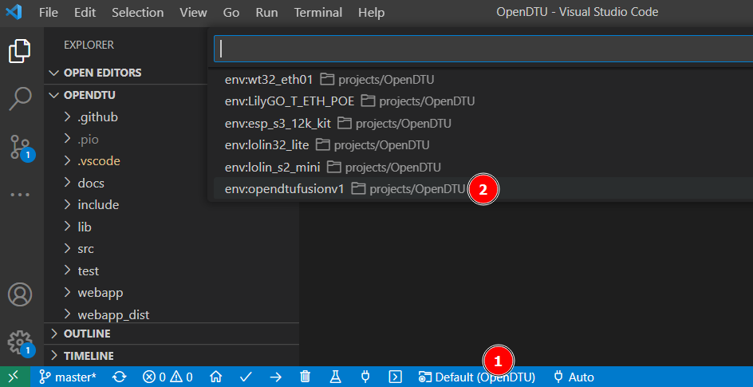
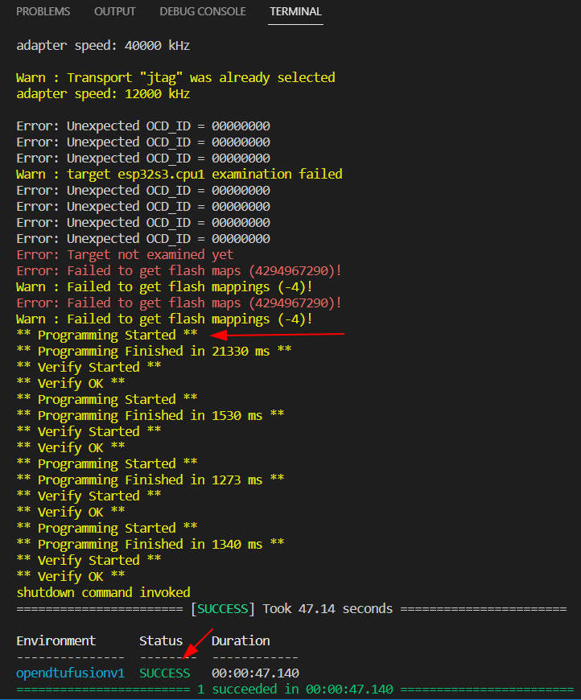

## Using pre-built Images
OpenDTU now offers generic ESP32-s3 builds [here](<https://github.com/tbnobody/OpenDTU/releases>). For the Fusion board, you need the USB version (as we use the in-built USB and no external converter):

As the name implies, for a new blank device (or if you want to change to OpenDTU from Ahoy), first erase and then flash the image marked in red which ends on factory.bin. .

For that, you can use the flash tool by Espressif. Use these settings after startup
(Alternatively you could use the web based installer:
https://www.opendtu.solar/firmware/webinstall/
Select "ESP32S3 with integrated USB connection"):

Then setup the tool like this:

For 1 choose your downloaded .factory.bin file, set 2-5, for 6 click the box and select the COM port (which there should be only 1 option, number will differ), then launch the (7) Erase button and wait for the FINISH logo to make sure the Flash is blank (this will erase all settings!), then click (8) Start to program.

After this has finished, press the reset button on the board or do a power cycle. Then go to [FLASHED_START.md](FLASHED_START.md).

The official OpenDTU docs also have instructions on how too use e.g. ESPTool. I personally prefer VS Code.

In case of any issues, in 99% of cases it is because you missed to perform a step or your drivers are not setup right. Check the [troubleshooting](TROUBLESHOOTING.md) guide

## Building yourself and flashing using VS Code
In general, these instructions are available in the official OpenDTU repo. Specifically:

In VSCode, when building for this board, make sure to use the correct profile opendtufusionv1 or v2 depending on which one you have, for most people it will be at least v2 as v1 was not publicly available outside community development:

When you then choose 'upload', it should look like this. The initial errors are normal as the board might not have anything flashed to it or the current Firmware is an incompatible version, so attaching the debugger fails, which is ok.
We just want the flashing to proceed, so look for `** Programming started **` and a `SUCCESS` at the end:

After this has finished, press the reset button on the board or do a power cycle. Then go to [FLASHED_START.md](FLASHED_START.md).

In case of any issues, in 99% of cases it is because you missed to perform a step or your drivers are not setup right. Check the [troubleshooting](TROUBLESHOOTING.md) guide
