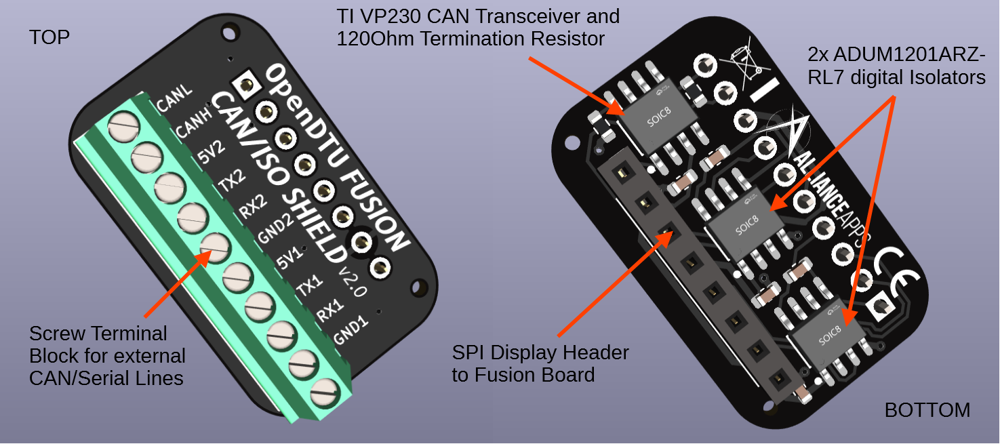
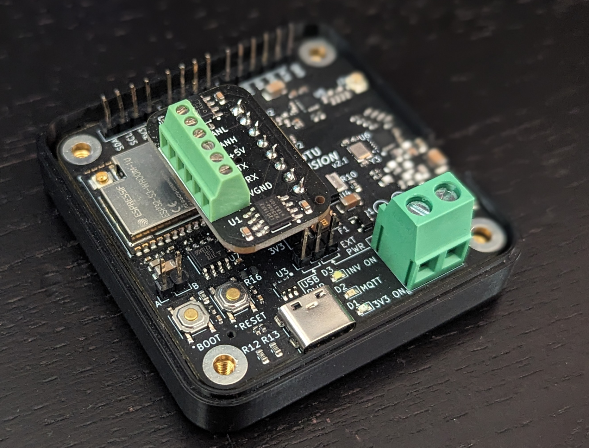
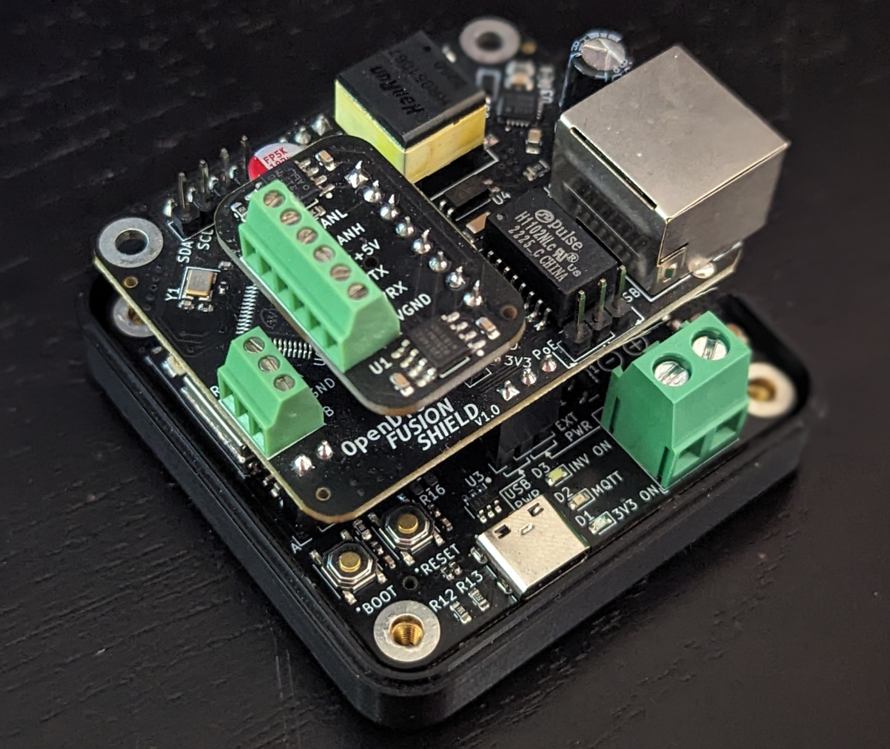

# OpenDTU Fusion CAN/Iso Shield Documentation



The OpenDTU Fusion CAN/Iso Shield is an extension Board specifically made to fit on top of the [OpenDTU Fusion](README.md) base board from v2.0 and later.
It provides a possibility to connect one CAN device via a Texas Instruments SN65HVD230DR (also known as VP230) CAN Transceiver, e.g. a Pylontech Battery in a 
OpenDTUonBattery Setup. It also has 2 Analog Devices ADUM1201ARZ-RL7 digital isolators on board which can be used to connect 2 serial inputs to the Fusion board with clean potential seperation. This is commonly used for e.g. VE.Direct connections of Victron charge controllers.

This shield consumes the SPI Display header of the Fusion board. It can also be stacked on top of the [PoE Shield](POE.md) if desired.

**IMPORTANT: Maintain the correct orientation as shown in the pictures below.Otherwise the supply pins will connect to data lines and it will not work and possibly damage GPIOs of the CAN Transceiver. Pictures show the v1 version with just 1 isolator, but the screw terminal orientation is the exact same for v2.**

On Fusion Base Board        | Stacked with PoE Shield
:-------------------------:|:-------------------------:
  |  

## Pin-Out

Please refer to the original Fusion board [README](README.md#Pin-mapping-of-the-ESP32-S3-on-OpenDTU-Fusion-v2x), for the ESP32-S3 GPIO mapping.

In case you wish to use the shield without the Fusion base board, the connection mapping from the screw terminal to the female pin header is as follows:


## Example Device JSON for OpenDTUonBattery

This example configuration enables both RFs and both victron inputs.
In case you are only using one victron you can disable the second pin set using `-1`. Also for now the TX pins can be set to `-1` but that is optional.
If you are not using a CAN-enabled battery you can disable the CAN ports in the `battery` section using `-1` as well.

```json
[
    {
        "name": "OpenDTU Fusion v2 + 2xVictron MPPT + Pylontech CAN",
        "nrf24": {
            "miso": 48,
            "mosi": 35,
            "clk": 36,
            "irq": 47,
            "en": 38,
            "cs": 37
        },
        "cmt": {
            "clk": 6,
            "cs": 4,
            "fcs": 21,
            "sdio": 5,
            "gpio2": 3,
            "gpio3": 8
        },
        "led": {
            "led0": 17,
            "led1": 18
        },
        "battery": {
            "rx": 13,
            "tx": 14
        },
        "victron": {
            "rx": 10,
            "tx": 9,
            "rx2": 11,
            "tx2": 12,
        },
    }
]
```