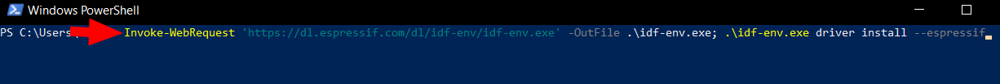
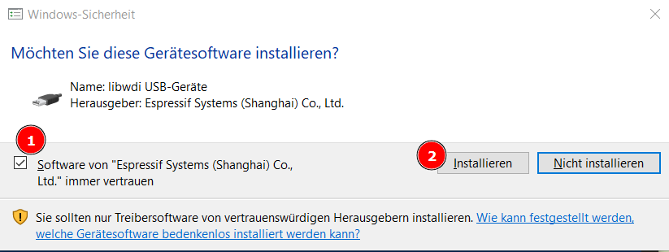

## Setup USB Driver and permissions

### Windows Drivers

In Windows there are generally no permission issues, but after setting up VS Code and the platformio-extension, before connecting the board, you want to install the USB-driver by Espressif:

Get a powershell and download the driver installer as described by [Espressif](https://docs.espressif.com/projects/esp-idf/en/latest/esp32s3/api-guides/jtag-debugging/configure-builtin-jtag.html#configure-usb-drivers)

```sh
Invoke-WebRequest 'https://dl.espressif.com/dl/idf-env/idf-env.exe' -OutFile .\idf-env.exe; .\idf-env.exe driver install --espressif
```



Then confirm the install


### Linux Permissions

In Linux, you will not require extra drivers, but make sure you have libusb and openocd installed. (the toolchain brings its own OpenOCD, but the system provided one generally creates the proper udev rules so you can access the devices as non-root, tested on Fedora)
If this is not the case for your distro, follow the guide by [Espressif](<https://docs.espressif.com/projects/esp-idf/en/latest/esp32s3/api-guides/dfu.html?highlight=udev%20rules#udev-rule-linux-only>).
