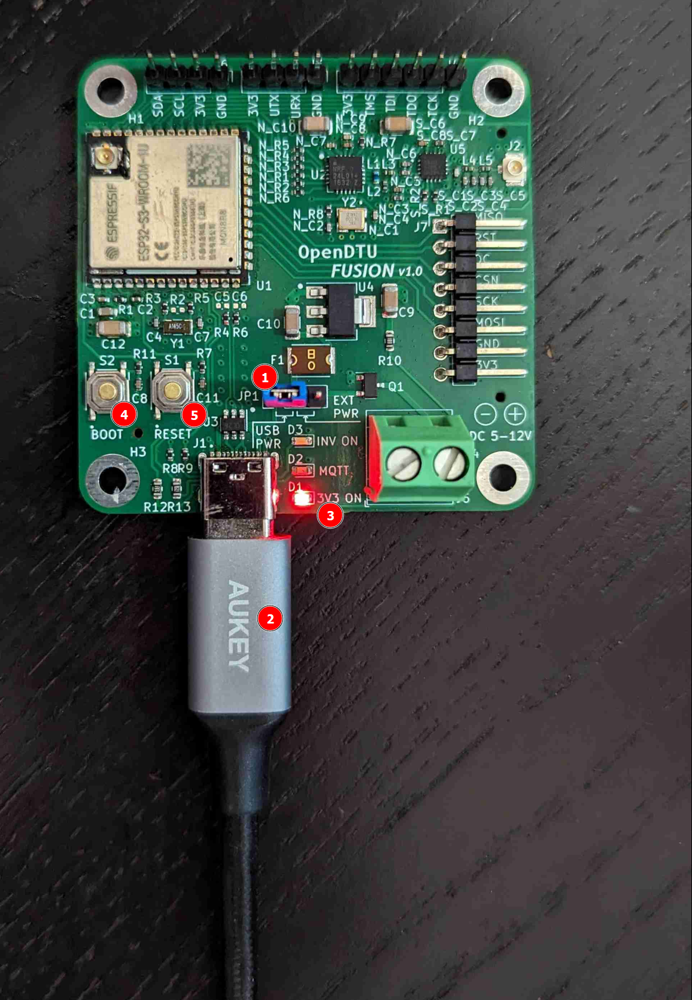
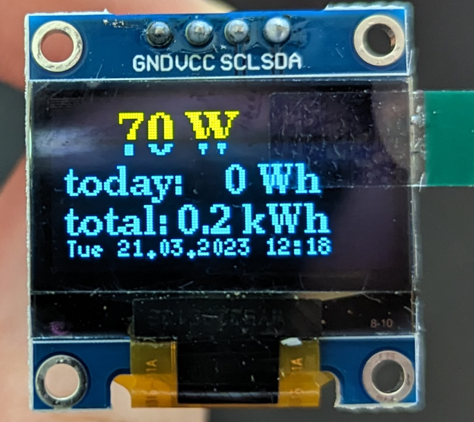
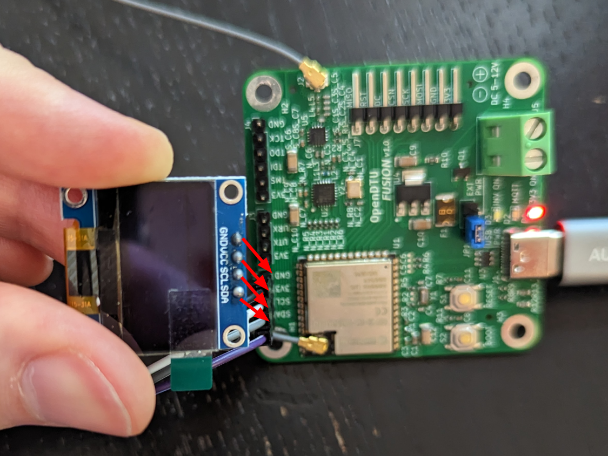

## Setting up the Board Hardware

1) make sure the power jumper is set to USB or your 5 DC power source
2) now plug in the board
3) verify the 3V3 power indicator LED comes on
4) press and hold the boot button
5) simultaniously press the reset button, afterwards you can release boot
6) make sure to connect the Wifi antenna
7) if you have a HM series inverter in use (or some compatible TSUN model) it requires NRF24 functionality, so connect this antenna
8) if you have a HMS/HMT series inverter in use, connect the CMT antenna here

This should have put the bootloader in flashing mode and the device should show up in your OS and you can flash, debug and monitor.

## Displays

As described above, the OpenDTU Fusion PCB supports all displays on hardware side that can be supported by Open/AhoyDTU on software side, like this 128x64 OLED I2C display with SSD1306 controller.

### Wiring up the display

First, make sure to wire your display up correctly, the silkscreen on the PCB shows the pin designations. Be especially careful not to switch GND and VDD/3V3:

The same goes for SPI displays, make sure your pinout is correct and you do it while the board is off.
