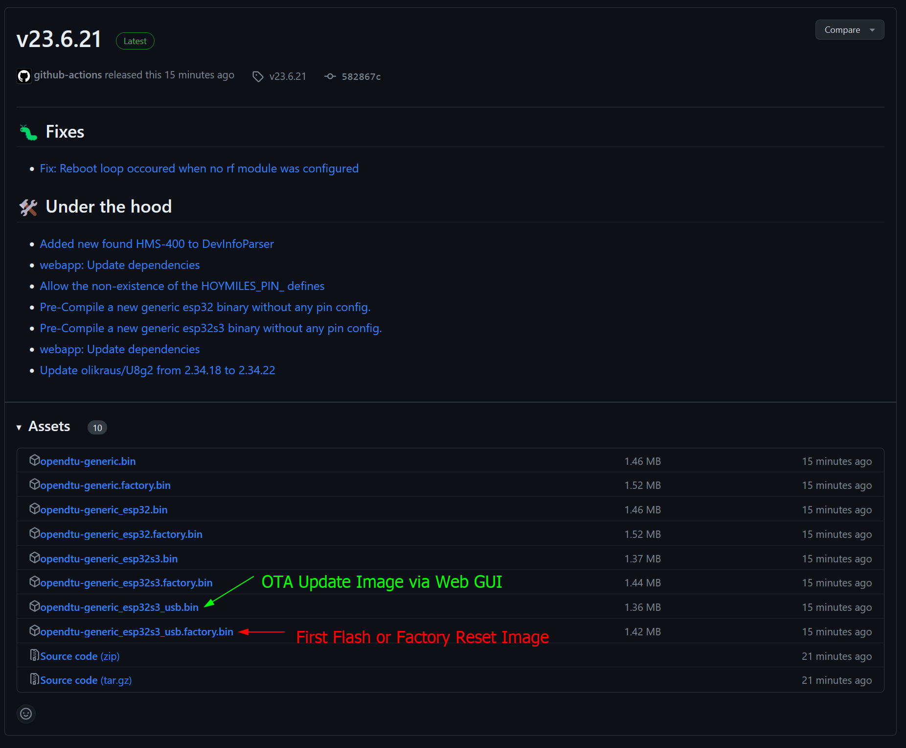
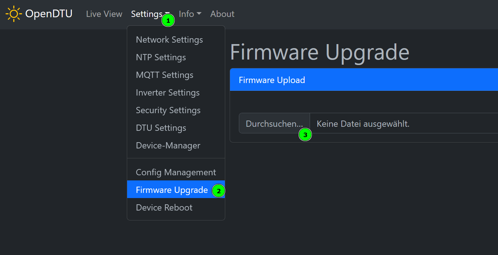
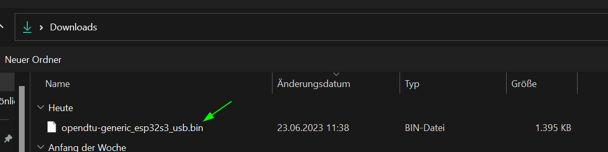
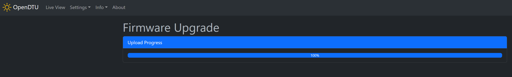
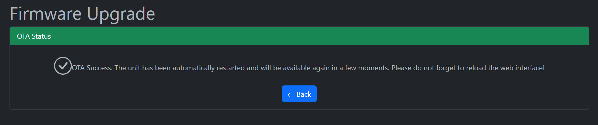

## Using pre-built Images

OpenDTU now offers generic ESP32-s3 builds [here](<https://github.com/tbnobody/OpenDTU/releases>). For the Fusion board, you need the USB version (as we use the in-built USB and no external converter):

Foor Over-the-Air (OTA) updates, download the non-factory .bin marked in green.

Then go to the web interface, select and flash it.

Wait for it...

Done.

