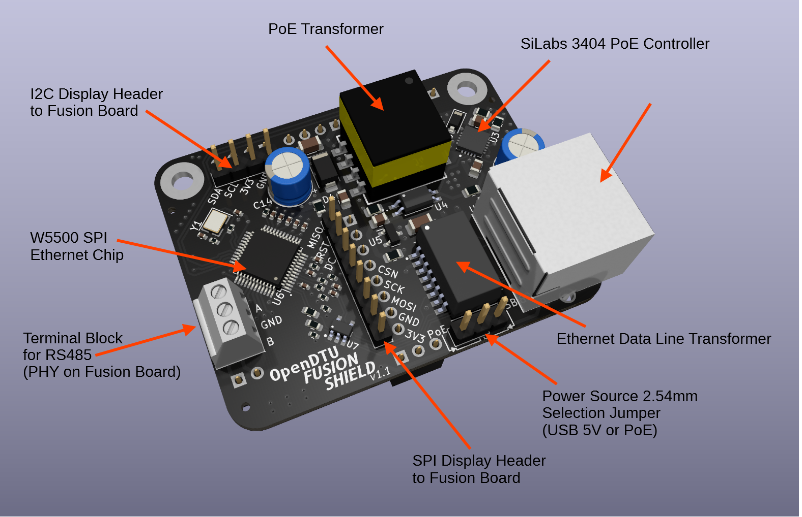

# OpenDTU Fusion PoE Shield Documentation

The OpenDTU Fusion Shield is an extension Board specifically made to fit on top of the [OpenDTU Fusion](README.md) base board from v2.0 and later.
It provides a possibility to power the Fusion board via Power over Ethernet and optionally also use an Ethernet data connection via the also included W5500 100MBit/s Ethernet chip, that connects to the ESP32-S3 on the base board via SPI. Additonally, the modbus header from the base board now leads to a screw terminal for easier install.

Both the display headers for I2C and SPI (for eInk) are connected through, so display configurations can still be used.

**IMPORTANT: This board strictly follows IEEE 802.3af Class 0 for PoE power delivery. Power injector adapters which just provide 48V or 24V passively without any negotiation will not work! (e.g. Unifi access points came with those passive 24V power ethernet injectors early on, these will not work and are not standard compliant!)**

The community has tested the board with several PoE capable switches out there from TP-Link, Netgear, Unifi and Aruba and all have worked. Just make sure your switch or PoE injector supports IEEE 802.3af and you should be good.

When raising issues, ALWAYS provide info against which hardware you have tested and make sure, if it all possible, you tried an alternative switch or adapter before you raise an issue. If you own a multimeter, providing a measurement of the output voltage also is helpful.

## Pin-Out

Please refer to the original Fusion board [README](README.md#Pin-mapping-of-the-ESP32-S3-on-OpenDTU-Fusion-v2.x), the pin table has the pins that are used for the W5500 SPI mentioned (uses the UART and JTAG headers), the pinout for I2C and display SPI headers is identical to the Fusion board.

## Using the power supply terminal block with PoE attached

As you will notice only USB and PoE can be jumpered when the PoE EThernet Shield is attached. In the case where you only want Ethernet but not PoE, and not use USB as a power source but the Terminal block,
simply jumper to PoE and use the terminal block on the base Fusion board AND recognize the following warning:

**ATTENTION: You have to manually take care to NOT inject PoE power in this use case. The output diode behind the PoE transformer will ensure the terminal block can be used safely, but that is only true when the PoE side is not powered. Injecting PoE power while using the terminal block can have adverse effects, inluding overheating, damaging the board or your power supply that drives the terminal block. Only use this setup when you know what you are doing electrically.**
