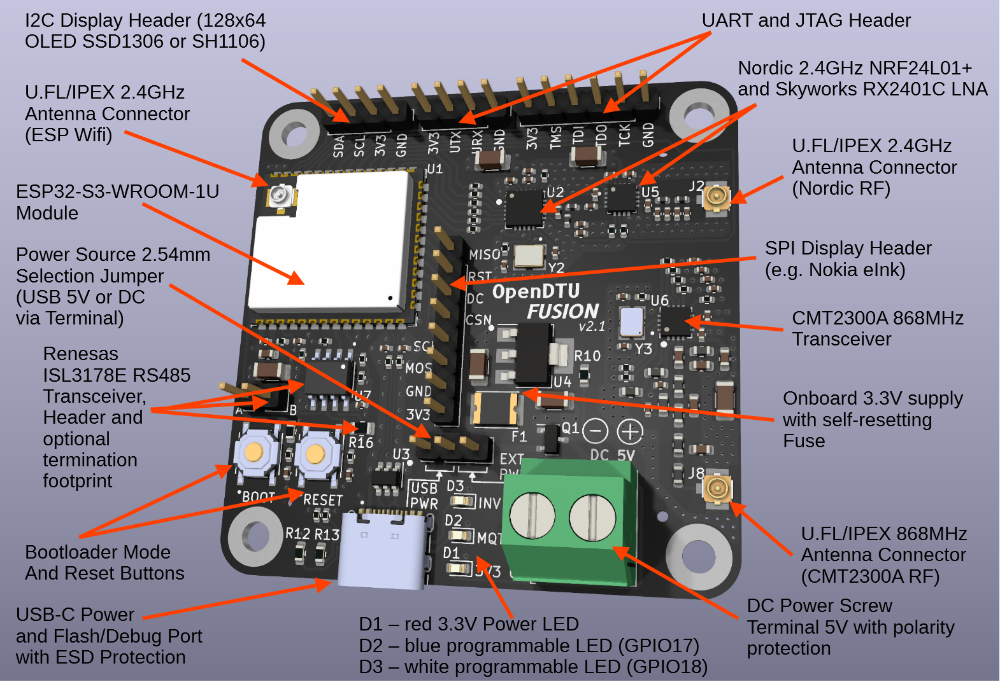

# OpenDTU Fusion Documentation

## Summary

OpenDTU Fusion is a very dense and small board which combines an
Espressif ESP32-S3-WROOM-1U module together with a
Nordic NRF24LP01+ and Skyworks RX2401C low noise amplifier to provide
a stable hardware base for OpenDTU and AhoyDTU opensource firmwares
to monitor and control Hoymiles HM solar inverters (as well as their
technically similar cousins like some Solenso or TSUN models).

Why another Open/AhoyDTU PCB you might ask?

The common solutions to buy seperate modules, soldering pin headers and using adapter PCBs are totally fine, but many people have issues with them. They might not be into electronics, but don't want to buy an expensive Hoymiles DTU, which costs a lot of money and forces you to use their cloud service. Some of the cheap NRF24 modules use fake chips that have issues, they cheap out on the RF design, and the PCB antennas meet their limits when there is more than 1 or 2 walls in the way. Some leave out the amplifier, further incerasing issues with reception performance.

So, with OpenDTU Fusion you get:

- no soldering of pin headers, or any parts of any kind
- a very compact form factor of just 5.5cm² to fit in your favorite case
- proper RF path layout and parts according to the manufacturer datasheets with proper thermal design, impedance matching etc.
- full antenna flexibility though U.FL/IPEX connectors: from a small PCB antenna adhered to your case to the full +8dBi external powerhouse everything is possible to fit your application
- full feature set of the ESP32-S3, flash/debug/monitor just by using a single USB-C cable

Many thanks to the OpenDTU/AhoyDTU community for providing reviews, testing and other valuable input. And KiCad for making such awesome open source PCB software.

## Specs

See this picture for the awesome features that this little board provides:


- Size: 5.5cm x 5.5cm, 4x M3 corner mounting holes (46mm pitch)
- Power: 5V via USB-C or 5-12V DC via screw terminal, selectable by 2.54mm jumper
- Wireless: UF.L/IPEX Antenna connectors to enable you to either use self-adhering PCB-Antennas or proper SMA-antennas outside your case for best send/receive performance
(IMPORTANT: these are full-size U.FL/IPEX connectors, not the 'mini' versions found on some laptop Wifi cards, which are often called U.FL/IPEX/MHF 4 or Gen4)
- USB-C connector with proper ESD-protection that provides all-in-one flashing/debugging/console monitor and power supply, no more extra USB/UART bridges or debug cables/probes required
- power supply secured by a self-resetting fuse should stuff go wrong -> no more soldering of SMD-Fuses to replace them
- 2 programmable LEDs connected directly to two of the ESP32-S3 GPIOs and a power indicator LED
- reverse polarity protection on the 5-12V DC screw terminal
- all the pin headers you will need:
  - I2C for sensors or displays
  - SPI header for e.g. eInk displays including 2 GPIO control lines
  - UART and JTAG header for classic access to flashing, monitoring console and debug (can also be used for other general purposes in software)

## IMPORTANT Application Notes

In general, follow the guidelines provided by the awesome [OpenDTU](https://github.com/tbnobody/OpenDTU) and [AhoyDTU](https://github.com/lumapu/ahoy) projects.

This documentation will mainly focus on the differences that this integrated board brings,
especially the more modern ESP32-S3 chip and its integrated USB-interface.

For how to generally build/deploy the DTU firmwares and using them, refer to the original projects above.

**BUT**: Do NOT use the generic firmware builds provided by OpenDTU with the Windows flasher tool approach.
They are for ESP32, not ESP32-S3 and will not work until there is a dedicated generic build for ESP32-S3.

## Setup USB Driver and permissions

### Windows Drivers

In Windows there are generally no permission issues, but after setting up VS Code and the platformio-extension, before connecting the board, you want to install the USB-driver by Espressif:

Get a powershell and download the driver installer as described by [Espressif](https://docs.espressif.com/projects/esp-idf/en/latest/esp32s3/api-guides/jtag-debugging/configure-builtin-jtag.html#configure-usb-drivers)

```sh
Invoke-WebRequest 'https://dl.espressif.com/dl/idf-env/idf-env.exe' -OutFile .\idf-env.exe; .\idf-env.exe driver install --espressif
```


Then confirm the install


### Linux Permissions

In Linux, you will not require extra drivers, but make sure you have libusb and openocd installed. (the toolchain brings its own OpenOCD, but the system provided one generally creates the proper udev rules so you can access the devices as non-root, tested on Fedora)
If this is not the case for your distro, follow the guide by [Espressif](<https://docs.espressif.com/projects/esp-idf/en/latest/esp32s3/api-guides/dfu.html?highlight=udev%20rules#udev-rule-linux-only>).

## Setting up the Board

1) make sure the power jumper is set to USB or your 5-12V DC power source is connected
2) now plug in the board
3) verify the 3V3 power indicator LED comes on
4) press and hold the boot button
5) simultaniously press the reset button, afterwards you can release boot

This should have put the bootloader in flashing mode and the device should show up in your OS and you can flash, debug and monitor.


In VSCode, when building for this board, make sure to use the correct profile:


When you then choose 'upload', it should look like this. The initial errors are normal as the board might not have anything flashed to it or the Fcurrent Firmware is an incompatible version, so attaching the debugger fails, which is ok.
We just want the flashing to proceed, so look for `** Programming started **` and a `SUCCESS` at the end:


After this has finished, press the reset button on the board or do a power cycle.
After a short period, the generic OpenDTU access point should show up in your Wifi search,
where you can then connect and perform the setup as documented by Open/AhoyDTU (the number will change with every board).

This should work even without an antenna attached if you are close by with your e.g. phone.


Here you can then enter your own Wifi and proceed:


## Print Console

If your driver setup is correct the print console should just work.
If you have multiple devices make sure to select the correct one in VS Code:


## Displays

As described above, the OpenDTUE Fusion PCB supports all displays on hardware side that can be supported by Open/AhoyDTU on software side, like this 128x64 OLED I2C display with SSD1306 controller.


### Wiring up the display

First, make sure to wire your display up correctly, the silkscreen on the PCB shows the pin designations. Be especially careful not to switch GND and VDD/3V3:


The same goes for SPI displays, make sure your pinout is correct and you do it while the board is off.

### Loading a Device Profile for the Display Pinout

Navigate to Config Management


and choose pin mapping as the restore item


and select the file for the OpenDTU Fusion PCB from the repo or your custom file.
The ESP32-S3 can map any GPIO pretty much anywhere, so if you want to use one of the other headers go ahead. Just make sure to not accidently use pins that are occupied by other functions. Refer to the mapping list at the very bottom of this document.


Then choose 'Restore'.


### Selecting the Profile

Navigate to 'Device Manager' in the settings menu and select your profile:


Scroll to the bottom and save it.


Now you can go to the 'Display' tab and adjust the different modes and options.


## Troubleshooting

When trying to flash you might see something like this:


This might indicate that:

- a driver is missing
- permissions are off
- driver is installed but not selected for the device

### Windows

Check, when board is connected and in bootloader-mode, that what you see in Device Manager is similar to this. There should be one generic COM port (number might differ) and a JTAG/Debug device.


For the debug device, make sure not the generic windows driver is used, but the one from Espressif:


If this is not the case, choose 'Update Driver' and then 'automatically'. When you installed the Espressif drivers as instructed, it shoudl switch to it. If if doesn't, do the manual selection.


For the COM port, it should just be the generic Windows serial device driver.

### Linux

Executing `lsusb` should return something like this when the boards is connected:


If not, check if libusb, openocd and other Linux dependencies listed by Espressif are installed.

Also, make sure you are in the proper group for /dev/tty* access as a user. often it is 'dialout', but can be different on other distributions:


If not, you can run

```sh
sudo usermod -a -G <group, e.g. dialout> <your username>
```

 and then re-login for it to become effective.

## Pin mapping of the ESP32-S3 on OpenDTU Fusion

The ESP32-S3 can map any GPIO function pretty much anywhere through firmware, but this is strictly for advanced users and developers who know what they are doing. So be warned, you are on your own from here.

Please note that the display SPI pin names are derived from typical eInk displays that are available, the naming and function might differ for other models. Check the function mapping
with the proper OpenDTU/AhoyDTU version that has support for those special displays.
In general, these pins can be used for any arbitrary funtion, just like the ones on the I2C, UART and JTAG headers.

The ESP32-S3 has many amazing internal peripherals that can be brought out, either with simple GPIO-functions or for sensors, touch, etc.
See the databook for all details.

|GPIO|Freely mappable|Connected To|Comment|
|----|--------------|------------|-------|
|GPIO0 |no|Boot button|ESP32-S3 special strapping pin|
|GPIO1 |yes|SCL|on I2C header|
|GPIO2 |yes|SDA|on I2C header|
|GPIO3 |no|n/a (open pin)|ESP32-S3 special strapping pin|
|GPIO4 |no|n/a (open pin)|reserved for future v2 board features|
|GPIO5 |no|n/a (open pin)|reserved for future v2 board features|
|GPIO6 |no|n/a (open pin)|reserved for future v2 board features|
|GPIO7 |no|n/a (open pin)|reserved for future v2 board features|
|GPIO8 |no|n/a (open pin)|reserved for future v2 board features|
|GPIO9 |yes|MOSI display|on SPI display header|
|GPIO10|yes|SCK display|on SPI display header|
|GPIO11|yes|CSN display|on SPI display header|
|GPIO12|yes|DC display|on SPI display header|
|GPIO13|yes|RST display|on SPI display header|
|GPIO14|yes|MISO (busy) display|on SPI display header|
|GPIO15|no|XTAL_32k_P|RTC 32kHz crystal|
|GPIO16|no|XTAL_32k_N|RTC 32kHz crystal|
|GPIO17|no|D2 (MQTT) blue LED|connected by R12 560 Ohm resistor|
|GPIO18|no|D3 (INV ON) white LED|connected by R13 820 Ohm resistor|
|GPIO19|no|USB_D-|USB differential data line|
|GPIO20|no|USB_D+|USB differential data line|
|GPIO21|no|n/a (open pin)|reserved for future v2 board features|
|GPIO22|no|n/a (not exposed)|used inside ESP32-S3-WROOM-1U module|
|GPIO23|no|n/a (not exposed)|used inside ESP32-S3-WROOM-1U module|
|GPIO24|no|n/a (not exposed)|used inside ESP32-S3-WROOM-1U module|
|GPIO25|no|n/a (not exposed)|used inside ESP32-S3-WROOM-1U module|
|GPIO26|no|n/a (not exposed)|used inside ESP32-S3-WROOM-1U module|
|GPIO27|no|n/a (not exposed)|used inside ESP32-S3-WROOM-1U module|
|GPIO28|no|n/a (not exposed)|used inside ESP32-S3-WROOM-1U module|
|GPIO29|no|n/a (not exposed)|used inside ESP32-S3-WROOM-1U module|
|GPIO30|no|n/a (not exposed)|used inside ESP32-S3-WROOM-1U module|
|GPIO31|no|n/a (not exposed)|used inside ESP32-S3-WROOM-1U module|
|GPIO32|no|n/a (not exposed)|used inside ESP32-S3-WROOM-1U module|
|GPIO33|no|n/a (not exposed)|used inside ESP32-S3-WROOM-1U module|
|GPIO34|no|n/a (not exposed)|used inside ESP32-S3-WROOM-1U module|
|GPIO35|no|MOSI NRF24|hardwired to Nordic RF|
|GPIO36|no|SCK NRF24|hardwired to Nordic RF|
|GPIO37|no|CSN NRF24|hardwired to Nordic RF|
|GPIO38|no|CE NRF24|hardwired to Nordic RF and Skyworks LNA|
|GPIO39|yes|TCK|ESP32-S3 default JTAG pins|
|GPIO40|yes|TDO|ESP32-S3 default JTAG pins|
|GPIO41|yes|TDI|ESP32-S3 default JTAG pins|
|GPIO42|yes|TMS|ESP32-S3 default JTAG pins|
|GPIO43|yes|UART_TX|ESP32-S3 default serial console|
|GPIO44|yes|UART_RX|ESP32-S3 default serial console|
|GPIO45|no|n/a (open pin)|ESP32-S3 special strapping pin|
|GPIO46|no|n/a (open pin)|ESP32-S3 special strapping pin|
|GPIO47|no|IRQ NRF24|hardwired to Nordic RF|
|GPIO48|no|MISO NRF24|hardwired to Nordic RF|
