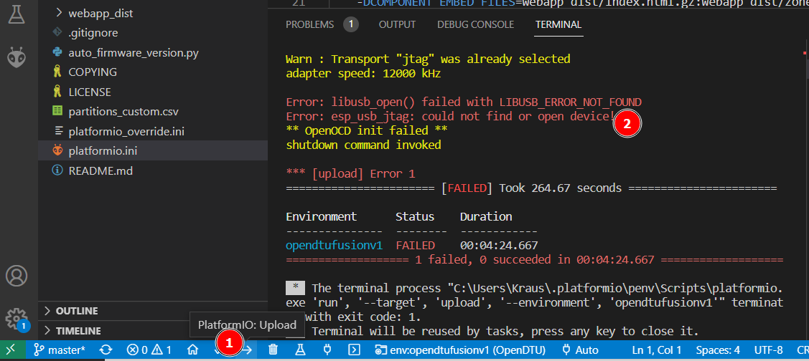
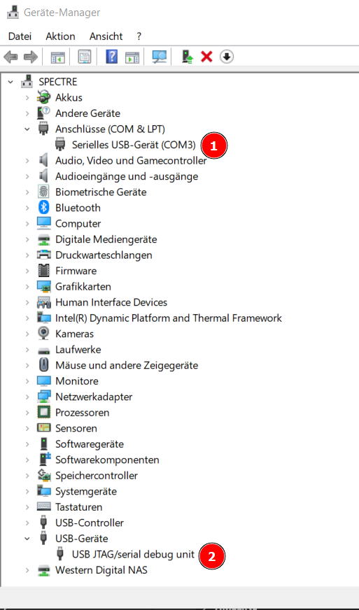
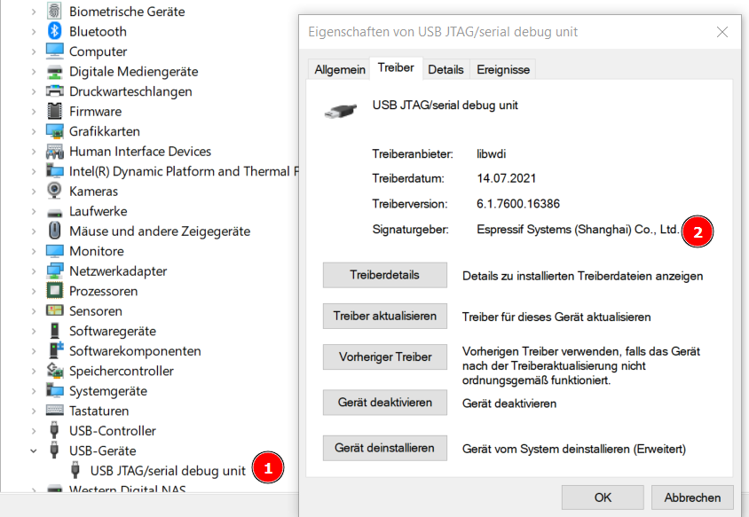
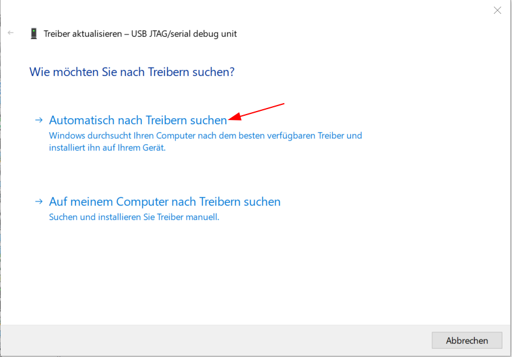
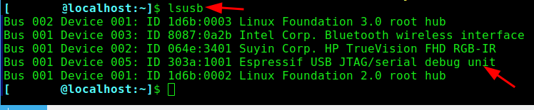
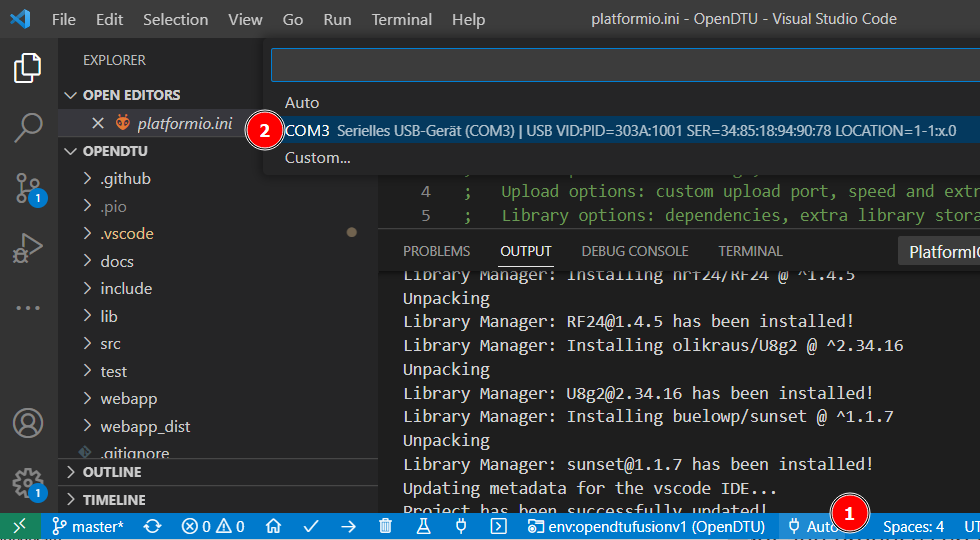

## Troubleshooting

When trying to flash you might see something like this:



This might indicate that:

- a driver is missing
- permissions are off
- driver is installed but not selected for the device

### Windows

Check, when board is connected and in bootloader-mode, that what you see in Device Manager is similar to this. There should be one generic COM port (number might differ) and a JTAG/Debug device.



For the debug device, make sure not the generic windows driver is used, but the one from Espressif:



If this is not the case, choose 'Update Driver' and then 'automatically'. When you installed the Espressif drivers as instructed, it should switch to it. If it doesn't, do the manual selection.



For the COM port, it should just be the generic Windows serial device driver.

### Linux

Executing `lsusb` should return something like this when the boards is connected:



If not, check if libusb, openocd and other Linux dependencies listed by Espressif are installed.

Also, make sure you are in the proper group for /dev/tty* access as a user. Often it is 'dialout', but can be different on other distributions:


If not, you can run

```sh
sudo usermod -a -G <group, e.g. dialout> <your username>
```

 and then re-login for it to become effective.

### Serial Print Console

If your driver setup is correct the print console should just work.
If you have multiple devices make sure to select the correct one in VS Code:


